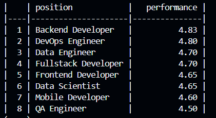

# Парсер статистики персонала

Считывает файлы .csv и выводит отчет по средней эффективности по позициям. Отчет сортируется от большей эффективности к меньшей.

## Функционал:

- Скрипт обрабатывает несколько файлов формата .csv за раз
- Есть возможность масштабирования скрипта, добавление функционала.

## Развертывание проекта:

1. **Клонировать репозиторий и перейти в директорию проекта**

   ```bash
   git clone git@github.com/yours_github_name/performance_test_task.git
   cd performance_test_task
   ```

2. **Создать и активировать виртуальное окружение (Python 3.9)**

   ```bash
   python -m venv venv
   # Windows
   venv\Scripts\activate
   # Linux/macOS
   source venv/bin/activate
   ```

3. **Установить зависимости**

   ```bash
   pip install --upgrade pip
   pip install -r requirements.txt
   ```

4. **Запуск парсера**

   ```bash
   python main.py -f file_name_1.csv file_name_2.csv -r performance

   -f FILES [FILES ...],
   --files FILES [FILES ...]
                        Путь к CSV-файлам
   -r {performance},
   --report {performance}
                        Средняя эфективность сотрудников      
                        сгруппированных по позициям
   ```

5. **pytest**

   ```bash
   pytest
   ```

6. **Покрытие тестами**

   ```bash
   pytest --cov=main --cov-report=term-missing
   ```

# Скриншоты вывода.

[Отчёт по performance](image/report.png)

